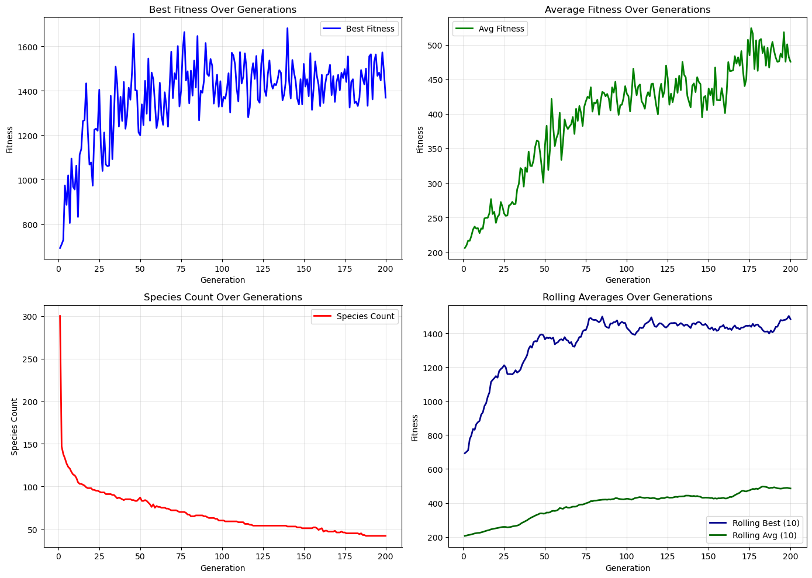
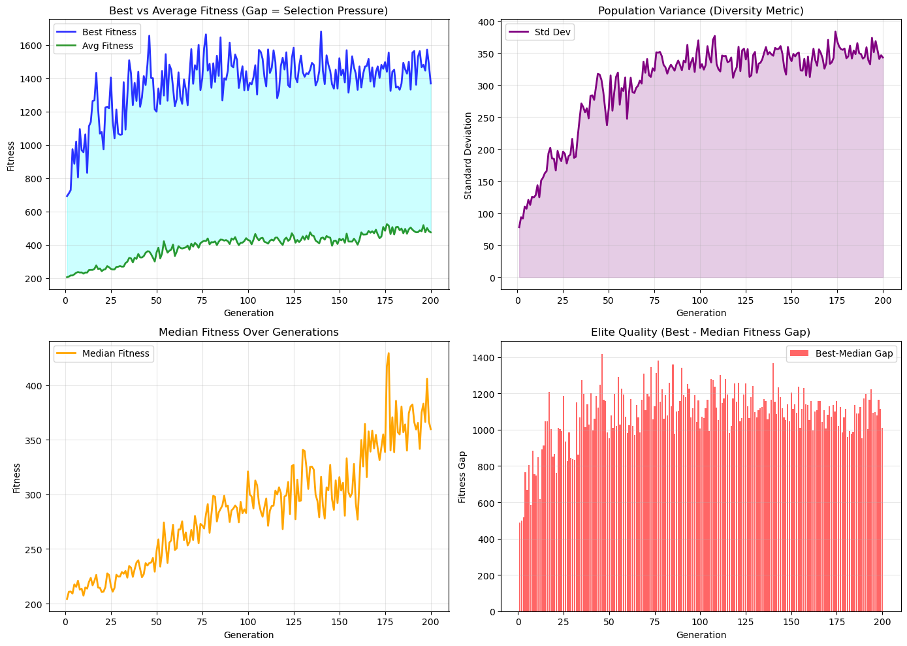
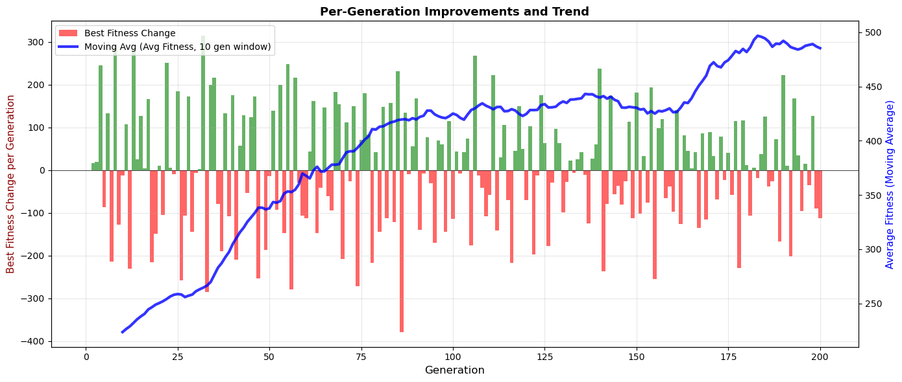

# SpiderML

SpiderML is a spider locomotion evolution simulation project built with:
- NEAT (NeuroEvolution of Augmenting Topologies)
- Box2D (physics)
- raylib (rendering and UI)

Each individual (spider) has its own genome and neural network that controls joint motors. Across generations, the population is evaluated by fitness, grouped into species, crossed over, and mutated.

## Results & Visualization

### Training Plots

The project generates detailed analysis plots during training. Check the `data_analyse/` folder for visualizations:

## What This Project Does

- Simulates a population of spiders in a 2D physics world.
- Evolves neural controllers for leg movement.
- Displays training metrics on screen.
- Logs per-generation statistics to a CSV file.

## Requirements

- CMake 3.15+
- C++17 compiler
- raylib
- Box2D

The project uses find_package(... CONFIG ...), so raylib and box2d must be available as CMake config packages in your environment.

## Build And Run

From the project root:

    mkdir build && cd build
    cmake ..
    cmake --build .
    ./SpiderML

## Where Statistics Are Stored

The CSV file is written to:

- build/training_stats.csv

Columns:

- generation
- best_fitness
- avg_fitness
- median_fitness
- stddev_fitness
- species_count
- rolling_best_10
- rolling_avg_10

Note: if the CSV header format changes, the application may recreate the file with the new header.

## Key NEAT Parameters

Parameters are defined in:
- src/evolution/NeatConfig.hpp

Most frequently tuned:
- kGenerationTimeSeconds: duration of one generation
- kCompatibilityThreshold: sensitivity of species splitting
- kCompatibilityC1, kCompatibilityC2, kCompatibilityC3: genome distance terms
- kGenomeMutateWeightsChance: chance of weight mutation per genome
- kAddConnectionChance: chance to add a connection
- kAddNodeChance: chance to add a node
- kInitialConnectionProbability: initial topology density
- kElitismCount: number of elites copied without mutation

## Current Simulation Setup

- Population size set in main.cpp: 300
- All spiders start from the same position (spawn spacing = 0)
- Generation duration: 20 s

## Metric Interpretation

- Increasing `rolling_avg_10` means the whole population is improving.
- Increasing `rolling_best_10` means top strategies are improving.
- High `stddev_fitness` means a high spread in individual quality, which is healthy for genetic diversity.
- **`species_count`**: A healthy simulation typically maintains multiple species (e.g., 40-60 for a population of 200). If this value drops to and stays at 1, it indicates weak divergence or overly permissive speciation (the "Species Trap"), meaning the population might be stuck in a local optimum.

## Performance Notes

Written purely in C++17, SpiderML is highly optimized. A standard simulation of 300 spiders using Box2D and NEAT runs efficiently on a single thread, utilizing minimal CPU resources (e.g., ~10-15% on modern architectures like Apple Silicon) while maintaining stable physics calculations and high frame rates.

## Directory Structure

- src/agent: spider body and simulation-level population management
- src/brain: neural network runtime
- src/genes: genome, population, mutations, crossover, speciation
- src/evolution: NEAT configuration
- build: build files and executable

## Typical Experiment Workflow

1. Set parameters in src/evolution/NeatConfig.hpp.
2. Build and run the project.
3. Let it run for dozens of generations.
4. Evaluate trends in build/training_stats.csv.
5. Adjust parameters and repeat.
